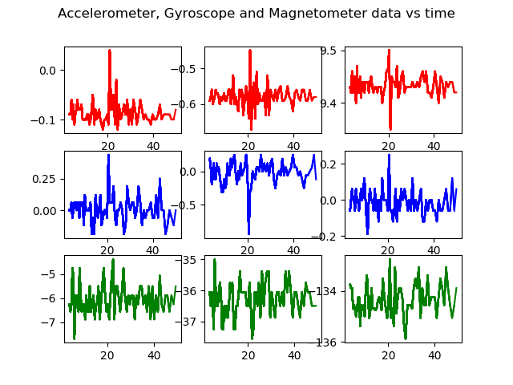
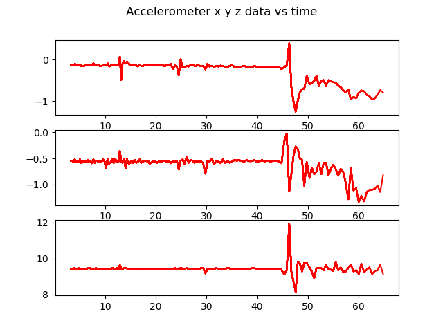

# BNO055_IMU_arduino

This repo shows you how to use BNO055 IMU

Hardware needed:

- BNO055 9-axis IMU sensor 
- Arduino (Nano used here)
- Male to Male Jumpers
- Breadboard
- Arduino to PC USB Cable

Wiring should be done as shown in the image below:

  

The connections are laid out here:

| Connect From Arduino |  Connect To IMU |
| ------------- | ------------- | 
| A4  | SDA  | 
| A5 | SCL | 
| GND | GND  | 
| 5V | Vin | 

Install the following on your Arduino IDE by going to **Tools > Manage Libraries**

- Arduino BNO055
- Adafruit Unified Sensor

Install Pyserial

    pip install pyserial

Verify the USB Port by entering:

    ls /dev/tty

After verifying, make this port an executable by entering:

    sudo chmod a+rw /dev/ttyUSB0 

## Graphs available

- 9 Axis data - *plot_all_9axis_live.py*

  

- Accelerometer 3-axis data - *plot_acc.py*

  

Code explanations:

| Serial Number| Code  | Function | Arduino Code Uploaded |
| ------------- | ------------- | ------------- |------------- |
| 1  | IMU_ACC_GYRO_MAG.ino | To access Acceleratometer, Gyroscope and Magnetometer data | IMU_ACC_GYRO_MAG |
| 2 |IMU_X_Y_Z | To get inclination w.r.t X, Y, and Z axes |IMU_X_Y_Z |
| 3 | IMU_QUARTERNION | Gets quarternion data from the BNO055 sensor | IMU_QUARTERNION |
| 3 |  imu_read.py| Code to access the serial imu data and display the results |IMU_ACC_GYRO_MAG |
| 4  |  plot_all_9axis_live.py | Access all 9 axis Serial data through python scripts |IMU_ACC_GYRO_MAG |
| 5 | plot_acc.py | Plotting only acceleratometer data|IMU_ACC_GYRO_MAG |
| 6 | quart_to_euler.py | Gets quarternion data and converts to Euler Angles and writes in a txt file | IMU_QUARTERNION |

 
