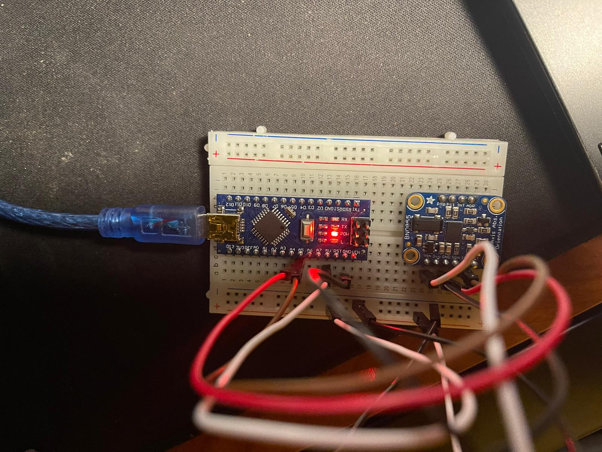

# BNO055_IMU_arduino

This repo shows you how to use BNO055 IMU

Hardware needed:

- BNO055 IMU
- Arduino (Nano used here)
- Male to Male Jumpers
- Breadboard
- Arduino to PC USB Cable

Wiring should be done as shown in the image below:

  

The connections are laid out here:

Install the following by going to **Tools > Manage Libraries**

- Arduino BNO055
- Adafruit Unified Sensor

Verify the USB Port by entering:

    ls /dev/tty

After verifying, make this port an executable by entering:

    sudo chmod a+rw /dev/ttyUSB0 

Code explanations:

| Serial Number| Code  | Function |
| ------------- | ------------- | ------------- |
| 1  | imu_test.ino | To access Acceleratometer, Gyroscope and Magnetometer data  |
| 2  |   | |
| 3 |  | |
| 4 |  | |
| 5 | | |
 
