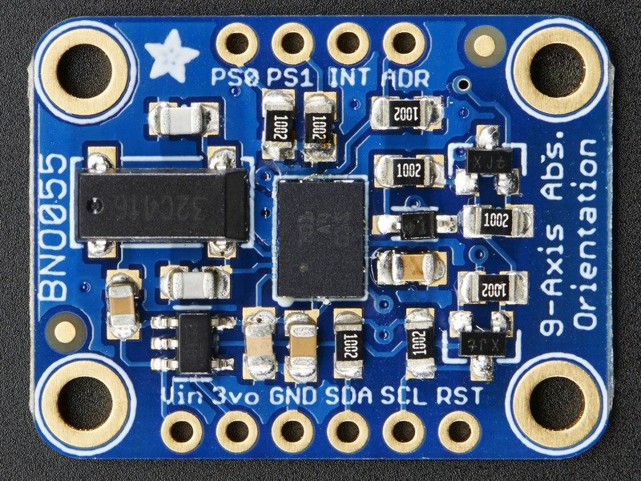
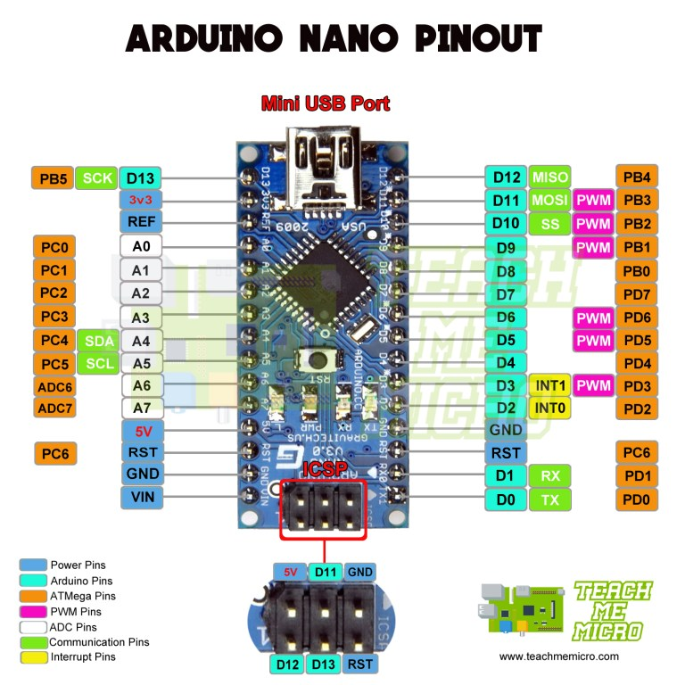
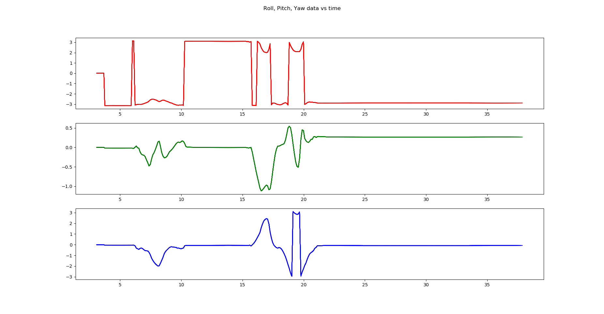

# BNO055_IMU_arduino

## Author

Govind Ajith Kumar

## OS

- Ubuntu 18.04
- Windows 10

This repo shows you how to use BNO055 IMU

<p align="center">
  
</p>

Hardware needed:

- BNO055 9-axis IMU sensor 
- Arduino (Nano used here)


<p align="center">
  
</p>

- Male to Male Jumpers
- Breadboard
- Arduino to PC USB Cable

Wiring should be done as shown in the image below:

<p align="center">
  
</p>

The connections are laid out here:

| Connect From Arduino |  Connect To IMU |
| ------------- | ------------- | 
| A4  | SDA  | 
| A5 | SCL | 
| GND | GND  | 
| 5V | Vin | 

Install the following on your Arduino IDE by going to **Tools > Manage Libraries**

- Arduino BNO055
- Adafruit Unified Sensor

Install Pyserial

    pip install pyserial

Verify the USB Port by entering:

    ls /dev/tty

After verifying, 

On **Ubuntu**, make this port an executable by entering:

    sudo chmod a+rw /dev/ttyUSB0 

On **Windows**, start command line as **administrator**, and run the python 
command

## Running Instructions

- To run on an Ubuntu computer, set the serial port to ```/dev/ttyUSB0```
- To run on a Windows computer, set the serial port to ```COM10``` or ```COM11```.


## Graphs available

- 9 Axis data - *plot_all_9axis_live.py*
<p align="center">
  
</p>

- Accelerometer 3-axis data - *plot_acc.py*
<p align="center">
  
</p>

- Roll Pitch Yaw data - *plot_roll_pitch_yaw_live.py*
<p align="center">
  
</p>

## ARDUINO C CODE LOOKUP TABLE


| Serial Number| Arduino Code Folder  | Function | 
| ------------- | ------------- | ------------- |
| 1  | IMU_ACC_GYRO_MAG | To access Acceleratometer, Gyroscope and Magnetometer data | 
| 2 |IMU_X_Y_Z | To get inclination w.r.t X, Y, and Z axes |
| 3 | IMU_QUARTERNION | Gets quarternion data from the BNO055 sensor | 
| 4 | CALLIBRATION_CHECK | To callibrate the Accelerometer, Gyroscope, Magnetometer and System of IMU | 
| 5 | ALL_IMU_DATA | Access all the possible data from BNO055 IMU |
| 6 | POSITION | Get position data from IMU | 

## PYTHON CODE LOOKUP TABLE

| Serial Number| Code  | Function | Arduino Code Uploaded |
| ------------- | ------------- | ------------- |------------- |
| 1 |  imu_read.py| Code to access the serial imu data and display the results |IMU_ACC_GYRO_MAG |
| 2  | plot_all_9axis_live.py | Access all 9 axis Serial data through python scripts |IMU_ACC_GYRO_MAG |
| 3 | plot_acc.py | Plotting only acceleratometer data|IMU_ACC_GYRO_MAG |
| 4 | quart_to_euler.py | Gets quarternion data and converts to Euler Angles and writes in a txt file | IMU_QUARTERNION |
| 5 | plot_roll_pitch_yaw_live.py | Gets quarternion data and converts to Euler Angles and plots it | IMU_QUARTERNION |

## Note

BNO055 is not suitable for X,Y, and Z positions. Use a GPS for that. This is because finding the x, y and z positions
involve double integration of the accelerometer data. And since the accelerometer data has a lot of noise,
the position will be way off. Please look into other measures.
 ## References

- Check the official Adafruit [GitHub](https://github.com/adafruit/Adafruit_BNO055.git) repo for reference
- For Odometry Fusion check [this](https://philsal.co.uk/projects/imu-attitude-estimation) link
